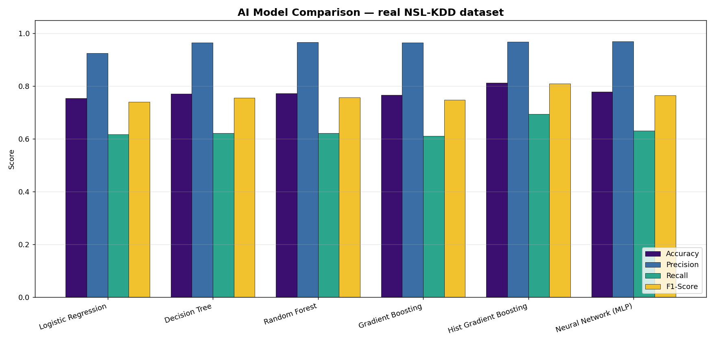
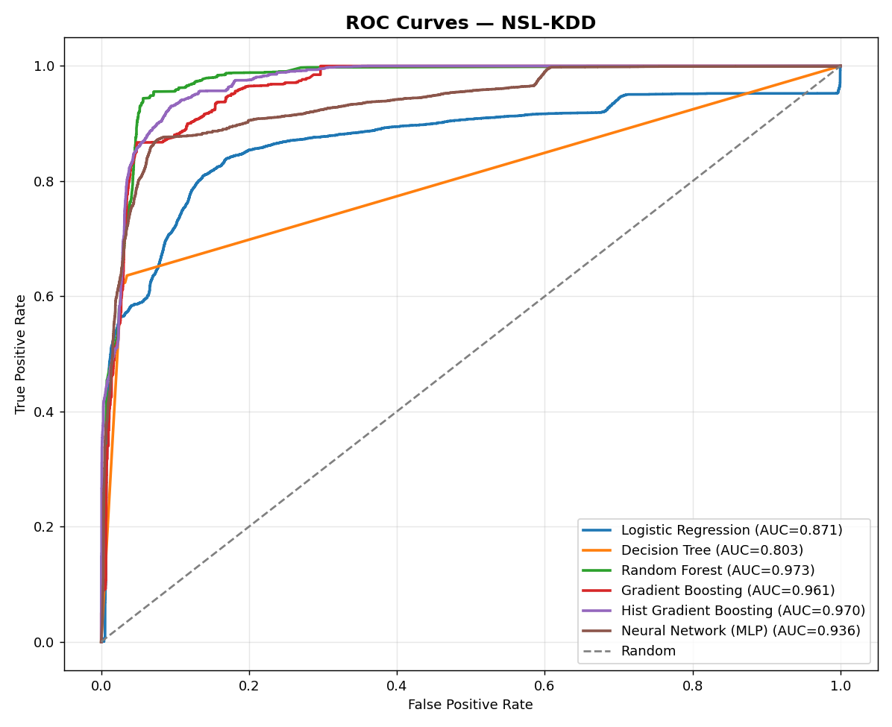
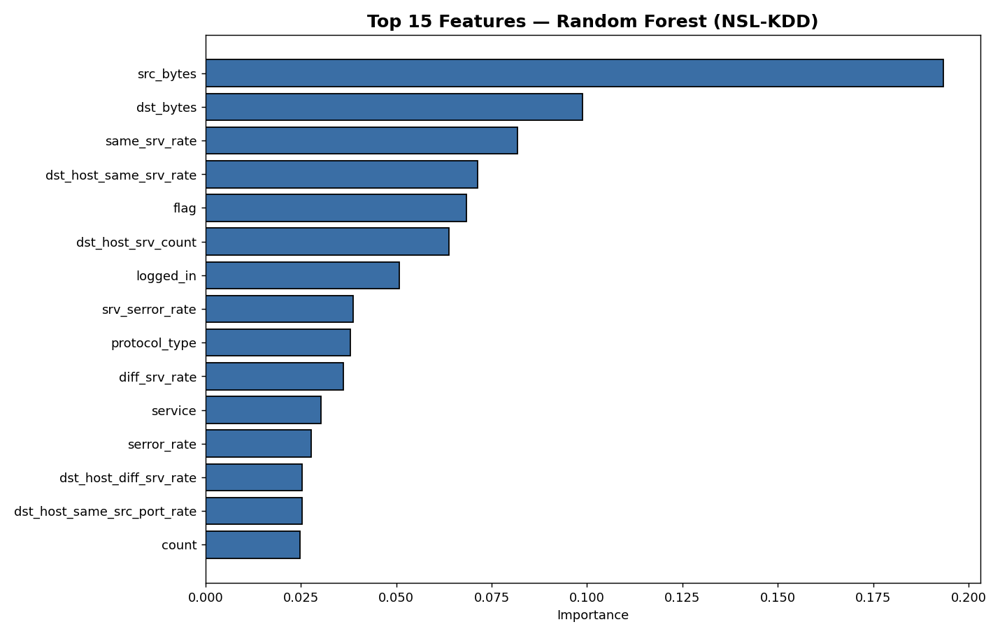
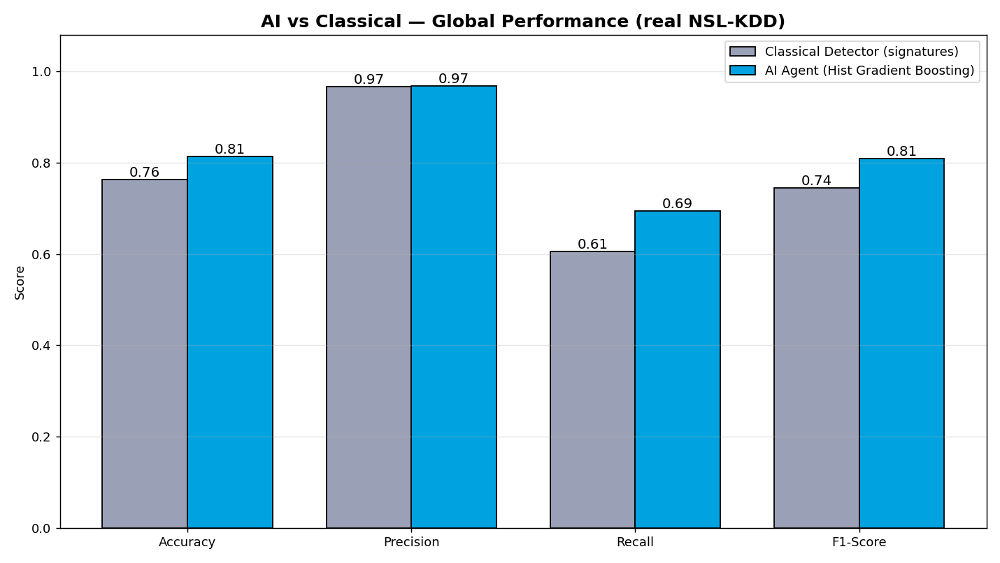
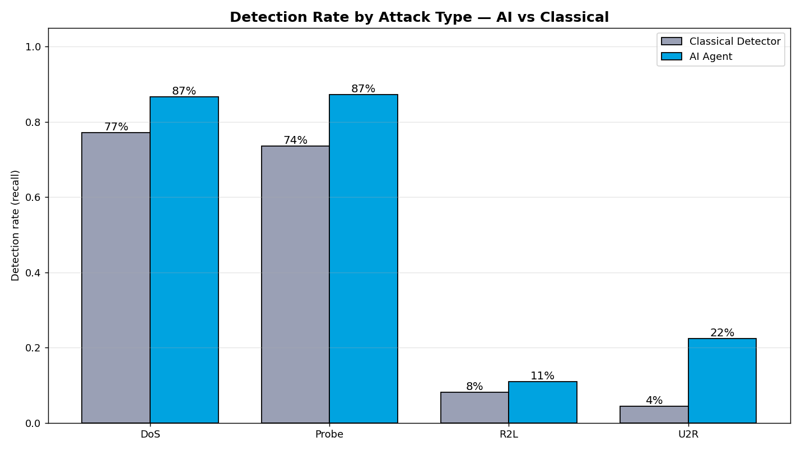
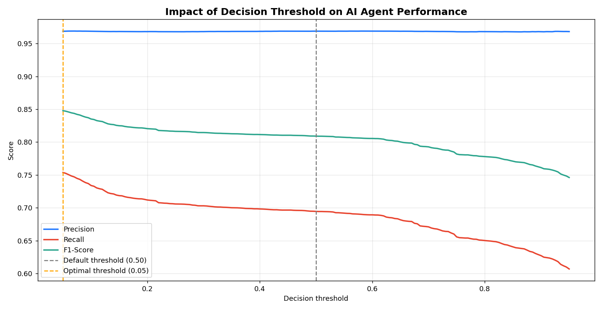
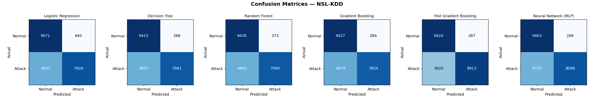

# A-NIDS — AI-based Network Intrusion Detection System

> Detecting network attacks with Machine Learning — a measured, reproducible comparison against classical signature-based detection, on the real **NSL-KDD** benchmark.

**Authors:** Amgoune Abderrahim · Hamza Elfakir · Yassine Moufattah
**Supervisor:** Prof. Aniss Moumen — ENSA Kénitra · RST / AI Module 2025–2026

---

## 1. The problem

Classical intrusion detection only sees what it already knows. Signature-based systems (Snort, Suricata), fixed-rule firewalls, and manual log analysis all share the same fundamental weakness: **they only detect attacks whose signature already exists in a database.** Any new or slightly modified attack — a zero-day — passes through completely unnoticed.

This matters because the threat landscape keeps moving: cyberattacks have risen sharply in recent years, the average time to detect an intrusion is measured in *months*, and a single breach costs millions. We wanted to test a concrete question with real data instead of opinions:

> **Can a model that *learns* traffic patterns detect intrusions more reliably than fixed rules — and crucially, does its advantage hold against attacks it has never seen before?**

---

## 2. The dataset — NSL-KDD

We use **NSL-KDD**, the reference academic benchmark for intrusion detection (the cleaned successor to KDD'99, with duplicates removed and better class balance).

| | |
|---|---|
| Training connections | **125,973** |
| Test connections | **22,544** |
| Features per connection | **41** |
| Classes | **5** (Normal + 4 attack families) |

The four attack families:

- **DoS** — Denial of Service: flooding to make the network unavailable (*neptune, smurf*)
- **Probe** — scanning the network to find weaknesses (*nmap, portsweep, satan*)
- **R2L** — Remote-to-Local: unauthorised remote access (*password guessing*)
- **U2R** — User-to-Root: privilege escalation once inside (*buffer overflow, rootkit*)

Two properties make this a genuinely hard, honest test:

1. **Severe class imbalance** — U2R has only **52** training examples versus 45,927 for DoS. Rare attacks are intrinsically hard to learn.
2. **A real zero-day test** — the test set contains **38** attack types, but training has only **23**. The model is evaluated on attacks it has *never* seen — a true test of generalisation, not memorisation.

---

## 3. System architecture

Five layers, with the AI agent at the core — from raw capture to automated response.

```
1. Capture        →  Flow metadata via NetFlow / IPFIX
2. Preprocessing  →  Categorical encoding + Z-score scaling (41 features)
3. AI Engine      →  The core — classifies each flow (benign vs attack)
4. Decision       →  5 threat levels: INFO → LOW → MEDIUM → HIGH → CRITICAL
5. Response       →  Automatic IP-blocking (with whitelist) + SOC alert
```

---

## 4. Two approaches, one fair comparison

The key to fairness: **both detectors are evaluated on the exact same 22,544 unseen test connections**, with a fixed random seed (`42`) for full reproducibility.

**Classical Detector (baseline).** Seven hand-written rules, e.g. `count > 100 AND serror_rate > 0.7 → DoS`. If no rule matches, the connection is declared *normal* — which is exactly why it cannot catch anything without a known signature.

**AI Agent (Histogram Gradient Boosting).** Learns patterns from 125,973 examples, captures non-linear relations across all 41 features, and outputs a tunable confidence score (0–1) that generalises to attacks never seen before.

### Model selection — we compared six models

We trained and benchmarked six classifiers on the same data and selected the best by F1 / speed trade-off.



**Histogram Gradient Boosting** gave the best F1-score while staying fast to train. ROC analysis confirms the ranking — the gradient-boosting and ensemble models cleanly separate benign from malicious traffic (AUC ≈ 0.97):



Feature importance (Random Forest) shows the model relies on meaningful, interpretable signals — byte volumes and service/error-rate statistics — not noise:



---

## 5. Results

### Global performance — AI vs Classical



| Metric | Classical Detector | AI Agent (Hist GB) |
|---|---|---|
| Accuracy | 0.76 | **0.81** |
| Precision | 0.97 | **0.97** |
| Recall | 0.61 | **0.69** |
| F1-Score | 0.74 | **0.81** |

Precision is essentially tied at ~97%. **The real difference is recall** — the AI misses far fewer attacks. In security, a missed attack costs far more than a false alarm, so recall is the metric that matters most.

### The key result — detection by attack type



| Attack type | Classical | AI Agent |
|---|---|---|
| DoS | 77% | **87%** |
| Probe | 74% | **87%** |
| R2L | 8% | **11%** |
| U2R | 4% | **22%** |

The AI wins across every category. Most strikingly, **U2R detection is multiplied by ~5** — the model learns rare privilege-escalation patterns that fixed rules simply cannot encode.

### Threshold tuning — catching even more attacks

By default a classifier flags "attack" at probability ≥ 0.50. But in security, we deliberately lower the decision threshold so the agent errs on the side of caution. Sweeping the threshold shows precision stays flat (~97%) while recall climbs as we lower it:



Setting the threshold to **0.05** raises recall from **69% → 75%** while keeping precision at **97%**, lifting the overall **F1-score to 0.848**.

### Confusion matrices (all models)



---

## 6. Project structure

```
A-NIDS/
├── data/                    # Real NSL-KDD dataset
│   ├── KDDTrain.txt
│   └── KDDTest.txt
├── src/
│   ├── data_loader.py       # Load & prepare NSL-KDD, map attacks to 4 families
│   ├── rule_based_ids.py    # Classical signature-based detector (baseline)
│   ├── train_agent.py       # Train & evaluate the 6 ML models
│   ├── optimize_agent.py    # Decision-threshold optimisation (→ 0.05)
│   ├── ai_agent.py          # Operational agent: threat levels + auto IP-blocking
│   ├── compare.py           # Head-to-head AI vs classical on the same test set
│   ├── app.py               # Flask dashboard (live demo)
│   ├── run_all.py           # Reproduce the whole pipeline end-to-end
│   ├── static/              # Dashboard JS + CSS
│   └── templates/           # Dashboard HTML
└── results/                 # Charts + metrics (JSON)
```

> **Note:** trained models (`models/*.pkl`) are not committed — they are fully regenerable. Run the pipeline below to recreate them.

---

## 7. How to run

```bash
# 1. Install dependencies
pip install -r requirements.txt

# 2. Reproduce everything (train models, optimise threshold, compare, plot)
cd src
python3 run_all.py

# 3. Launch the live dashboard
python3 app.py
# → open http://localhost:5000
```

The dashboard analyses real NSL-KDD connections live, runs **both** detectors on each one, scores a threat level (INFO → CRITICAL), automatically blocks malicious IPs, and shows a *verdict* column highlighting exactly when the AI catches an attack the rules miss.

---

## 8. Conclusion & perspectives

**What we proved.** A learning agent classifies network traffic more reliably than fixed rules, and — most importantly — it **generalises to unknown attacks**, which a rule-based system cannot do by design.

**Honest limitation.** R2L and U2R stay hard to detect (11% and 22%). With only 52 U2R and 995 R2L training examples, the model simply has too few samples — the well-known NSL-KDD imbalance, not a flaw in the approach.

**Where we'd go next:**

- Class rebalancing (e.g. SMOTE) to boost rare-attack detection
- Multi-class output predicting the *exact* attack type, not just benign/attack
- Explainability with SHAP / LIME for analyst trust
- Moving to modern datasets (CICIDS2017) and deep-learning architectures

---

## Tech stack

`Python` · `scikit-learn` · `Flask` · `pandas` / `NumPy` · `Matplotlib`

**Best model:** `HistGradientBoostingClassifier(max_iter=300, max_depth=12)` · optimal threshold `0.05`
